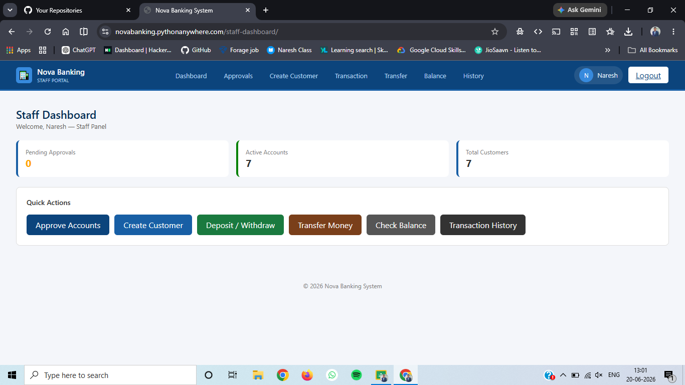
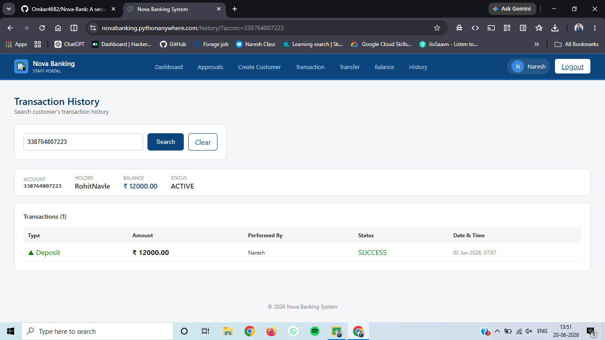
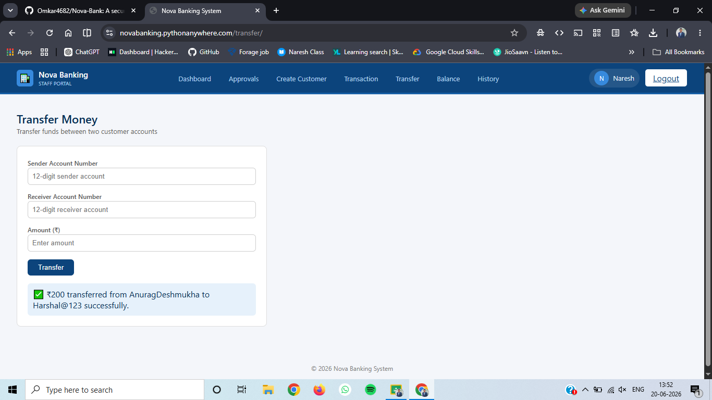
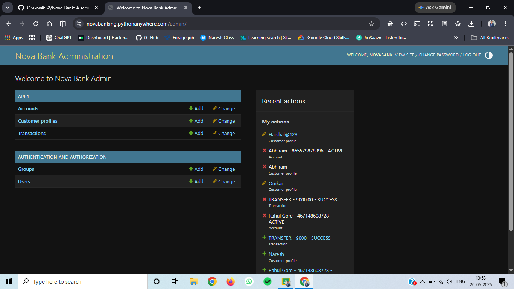

Nova Banking Web Application

A secure and role-based banking web application built using Django and MySQL that simulates  
banking operations such as account management, deposits, withdrawals, fund transfers, and transaction tracking ,Balance Checking.

Live Demo
https://novabanking.pythonanywhere.com/

Nova Banking Web Application

Features

Authentication & Authorization
Role-Based Login System (Admin, Staff, User)
Secure Session Authentication
Password Hashing using Django Authentication System
Login Required Access Control
CSRF Protection
Banking Operations
Account Creation and Management
Deposit and Withdrawal System
Fund Transfer Between Accounts
Real-Time Balance Updates
Transaction History Tracking
Search and Filter Transactions
Admin & Staff Functionalities
User Management
Account Monitoring
Transaction Monitoring
Role-Based Dashboard Access
Technical Features
Custom Django User Model
MySQL Relational Database
Responsive User Interface
Organized Django Project Structure
Separate Django Apps Architecture
Secure Backend Validation

Tech Stack
Backend
Python
Django
Database
MySQL

Frontend
HTML
CSS
Bootstrap
Deployment
PythonAnywhere

Tools
Git
GitHub
VS Code
PyCharm
Project Structure
Nova-Banking-System/

Installation

Clone Repository

git clone https://github.com/Omkar4682/Nova-Bank.git

Move to Project Directory

cd YOUR-REPOSITORY-NAME

Create Virtual Environment
python -m venv venv

Activate Virtual Environment
Windows
venv\Scripts\activate

Linux / Mac
source venv/bin/activate

Install Dependencies
pip install -r requirements.txt

Configure Database

Update your MySQL database settings in:

settings.py
Apply Migrations
python manage.py makemigrations
python manage.py migrate

Run Development Server
python manage.py runserver

Open in browser:

http://127.0.0.1:8000/
├── accounts/
├── transactions/
├── users/
├── templates/
├── static/
├── media/
├── manage.py

Screenshots

Login Page

Dashboard

Transaction History

Fund Transfer

Admin Panel

Future Improvements

REST API Integration using Django REST Framework

JWT Authentication
Email Notifications
Docker Deployment
Pagination
Advanced Analytics Dashboard

Author
Omkar Pandharinath Date
GitHub:https://github.com/Omkar4682?
LinkedIn:https://linkedin.com/in/omkar-date-04969435b

├── requirements.txt
└── README.md
